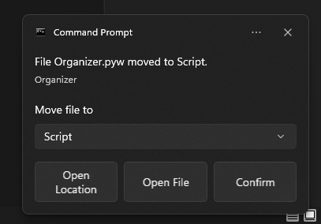
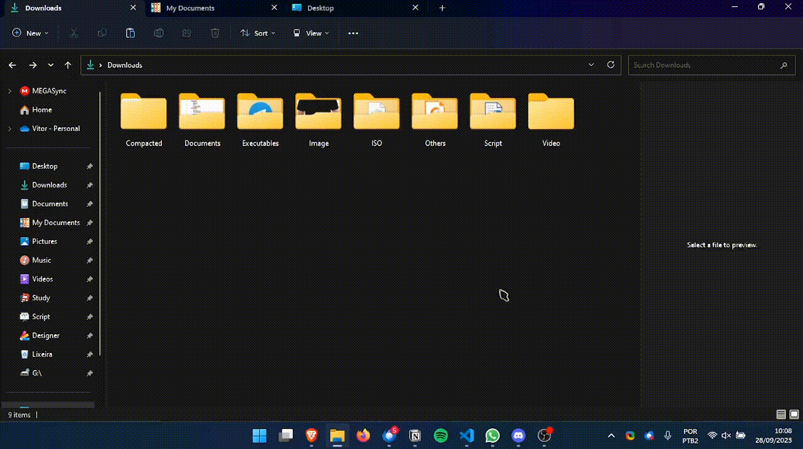
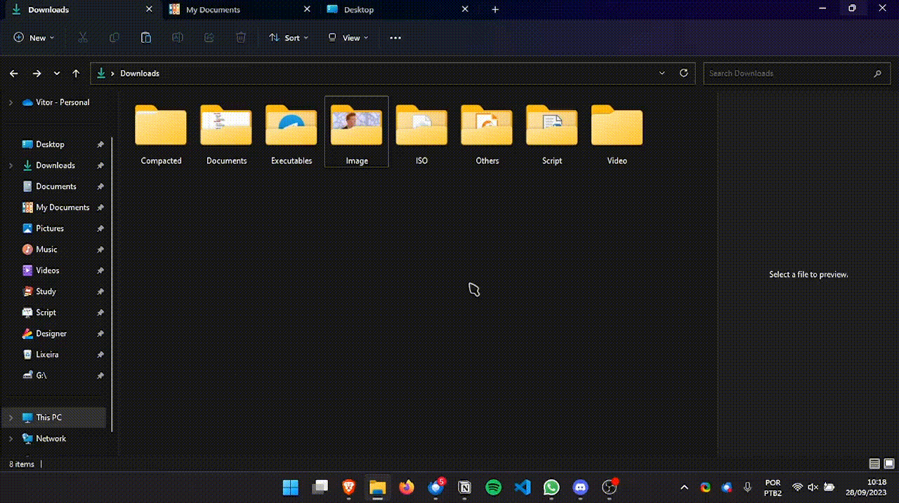

<h2 align="center">Organizer</h2>

[]()
[](/LICENSE)

<!-- []()
</div> -->

<p align="center"> 
    Organizer is a Simple Python Folder Organizer to Windows 10 and 11, it send a notification when organize some files with two button, one open Windows Explorer with file moved selected and another to open the file. Feel free to do any pull request or issue to incluid some file extension or make improvements.
</p>
<div align="center">
    <a href="" rel="">
        
    </a>
</div>

## Usage
<div align="center">
    <a href="" rel="">
        
    </a>
</div>
<div align="center">
    <a href="" rel="">
        
    </a>
</div>
<div align="center">
    <a href="" rel="">
        
    </a>
</div>


## Bugs Known

-   When downloading something with qBitTorrent Organizer move the file infinit, yet searching for a solution. As a solution you can set qBitTorrent to use .!qB file extention.
-   When repeat name only can count untill 10.

## Change folder, Added Files or add exeption

Open the Organizer file first thing you'll see there are `path` to organize `types` to file extentions and exeption file extentions will not be moved.

## Added a dropdown folder 

Open the Organizer file, in the firsts lines you'll see a dict `folderShortCurts`, flow the exemple to added more shortcurts.

## Instalation

**1st** For instalation you'll need install `Python`:
https://www.python.org/downloads/

**2nd** After you will need to added `pip` command as global varable on Windows.

**3rd** Install windows_toasts libray running:

```
pip install windows_toasts
```

**Note**: Here Organizer will be ready to work, but if you want to automatize it when you startup your PC, then:

**4th** Move `Organizer.pyw` to `C:\Users\%username%\AppData\Roaming\Microsoft\Windows\Start Menu\Programs\Startup`

Now when you start your PC, Organizer will oranizer your files on Download folder.

## Future Plans

-   Add a UI interface.
-   Make more controlable to use `.exe` files.
-   Added support to Linux Systems.

## 💻 Technologies Used <a name="Technologies_Used" ></a>

-   Python
-   windows_toasts
